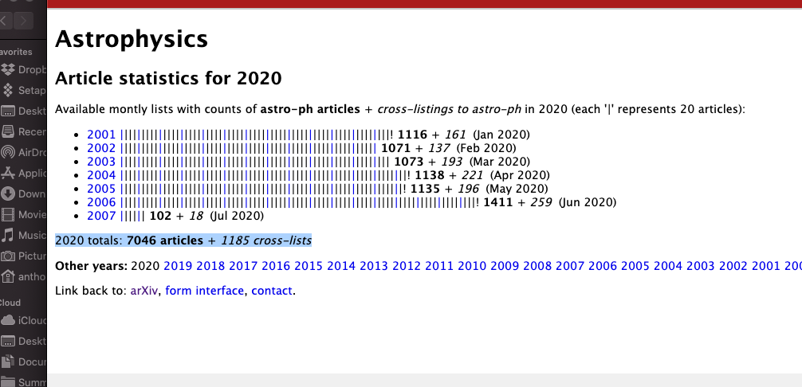

```{r setup, include=FALSE}
knitr::opts_chunk$set(echo = TRUE)
library(tidyverse)
library(rvest)
library(stringr)
```

## Scratch: get a random link
```{r}
url <- "https://arxiv.org/"
arXiv <- read_html(url)
arXiv_session <- html_session(url)

get_link <- function(link, tag) {
  read_html(link) %>% 
    html_nodes(tag) %>%
    html_attr("href") %>% 
    paste(url, ., sep = "")
}

logic_link <- get_link(url, 
                       "#math\\.LO")

apaper_link <- get_link(logic_link, 
                        "dl:nth-child(9) dt:nth-child(1) .list-identifier a:nth-child(1)")

otherformat_link <- get_link(apaper_link, 
                             ".full-text li~ li+ li .abs-button")

download_link <- get_link(otherformat_link, 
                          "dd b+ a")

# useless for now
arXiv_session %>% 
  jump_to(logic_link) %>% 
  jump_to(apaper_link) %>% 
  jump_to(otherformat_link)


# untar.gz files
file_name <- download_link %>% 
  str_extract("(?:.(?!\\/))+$")
download.file(download_link, paste("./Download/targz", file_name, ".tar.gz", sep = ""))

unzipped_path <- paste("./Download/unzipped", file_name, sep = "")
dir.create(unzipped_path)

command <- paste('cd ', unzipped_path, '; tar -zxvf ../../targz', file_name, '.tar.gz', sep = "")
system(command)


```

# Get all topics and each topic's statistics
```{r}
# excluding main-cs 
topic_links <- get_link(url, "#main-math-ph , #main-hep-th , #main-nlin , #main-hep-ph , #main-nucl-ex , #main-hep-lat , #main-nucl-th , #main-hep-ex , #main-physics , #main-gr-qc , #main-quant-ph , #main-math , #main-q-bio , #main-q-fin , #main-stat , #main-eess , #main-econ , #main-cond-mat , #main-astro-ph")

topics <- read_html(url) %>% 
    html_nodes("#main-math-ph , #main-hep-th , #main-nlin , #main-hep-ph , #main-nucl-ex , #main-hep-lat , #main-nucl-th , #main-hep-ex , #main-physics , #main-gr-qc , #main-quant-ph , #main-math , #main-q-bio , #main-q-fin , #main-stat , #main-eess , #main-econ , #main-cond-mat , #main-astro-ph") %>% 
    html_text()

topicdf <- data.frame()
topic_statistics <- data.frame()

for (i in seq_along(topic_links)) {
  link_2020 <- get_link(topic_links[i],"#content br+ a") 
  
  statistics_2020 <- read_html(link_2020) %>% 
    html_nodes("ul+ p") %>% 
    html_text()
  
  articles_crosslists <- statistics_2020 %>% 
    str_extract_all("(?<=\\s)\\d.*?(?=\\s)") %>% 
    `[[`(1) %>% 
    as.integer()
  
  categories <- read_html(topic_links[i]) %>% 
    html_nodes("h2+ ul b") %>% 
    html_text()
  
  df2 <- data.frame(main = topics[i],
                        articles = articles_crosslists[1], 
                        crosslists = articles_crosslists[2])
  topic_statistics <- rbind(topic_statistics, df2)
  
  if (identical(categories,character(0))) {
    df1 <- data.frame(main = topics[i], 
                      category = topics[i])
    topicdf <- rbind(topicdf, df1)
  } else {
    for (j in seq_along(categories)) {
      df1 <- data.frame(main = topics[i], 
                        category = categories[j])
      topicdf <- rbind(topicdf, df1)
    }
  }
}

###
topicdf
# change all char columns to factor
topicdf[sapply(topicdf, is.character)] <- lapply(topicdf[sapply(topicdf, is.character)], 
                                       as.factor)

###
topic_statistics
# change all char columns to factor
topic_statistics[sapply(topic_statistics, is.character)] <- lapply(topic_statistics[sapply(topic_statistics, is.character)], 
                                       as.factor)

```



Note: ![Here][https://arxiv.org/help/stats/2019_by_area/index] does have submission rates, but it is not current.